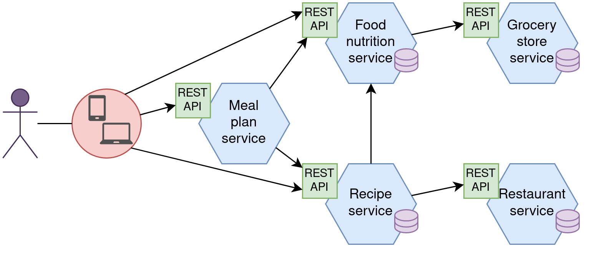

# Микросервисы: схема расширения приложения 

Приложение для составления рациона еды. 

Пользователь через мобильное приложение или сайт взаимодействует с сервисом составления рационов еды или сервисами рецептов и продуктов для добавления новой информации.

- Meal plan service — сервис составления рационов еды. Общается с сервисом продуктов и рецептов для генерации рационов.
    - Расчёт нормы КБЖУ по параметрам пользователя.
    - Генерация наборов рецептов/продуктов, удовлетворяющих норме.

- Food nutrition service — сервис продуктов и их пищевой ценности. Делает запросы сервису продуктовых магазинов для пополнения своей базы данных.

- Recipe service — сервис хранения и создания рецептов. 
    - Пищевая ценность рецептов.
    - Инструкции приготовления еды.
    - Где можно купить блюдо.

- Grocery store service — сервис-агрегатор продуктовых магазинов. 
    - Сканирует сайты продуктовых магазинов.
    - Предоставляет списки продуктов с ценами.

- Restaurant service — сервис-агрегатор ресторанов.
    - Сканирует сайты ресторанов.
    - Предоставляет альтернативы с ценами при поиске рецептов (где заказать блюдо вместо готовки по рецепту). 

